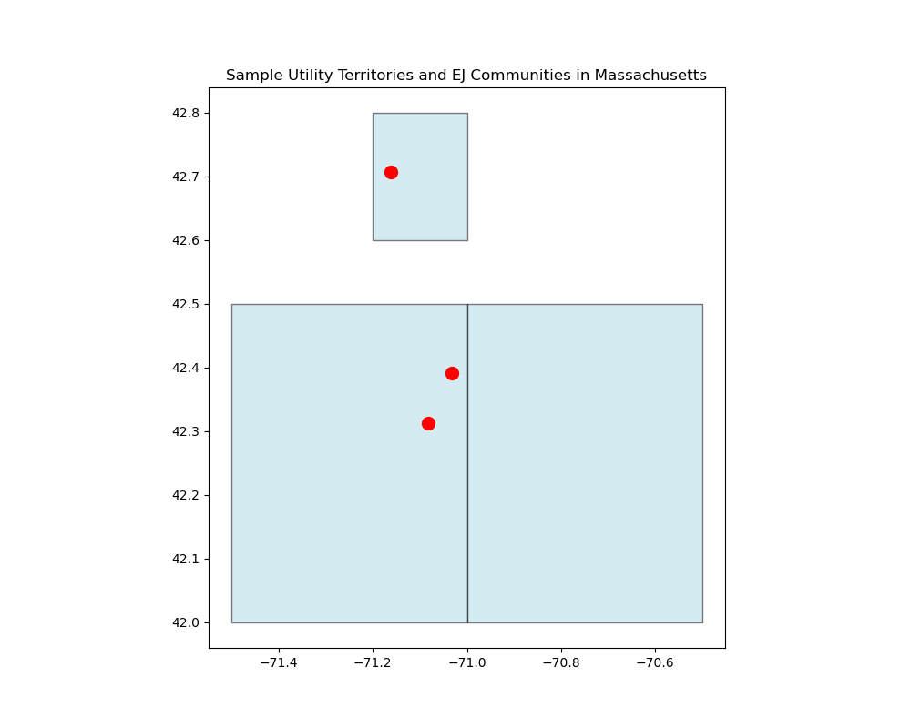
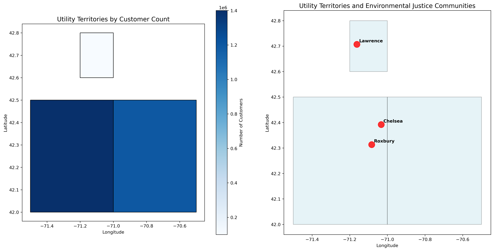
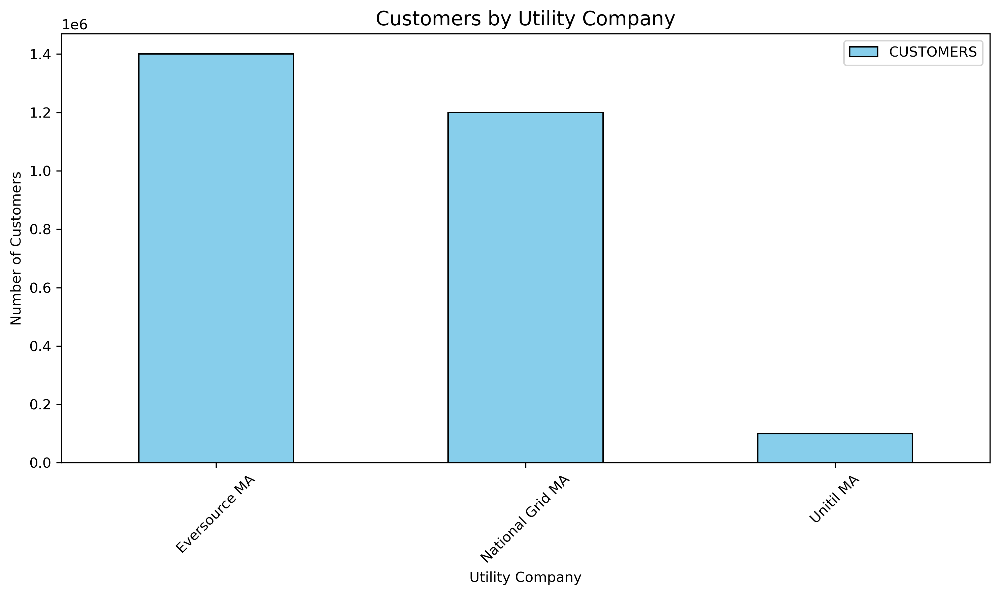

# PowerGrid Vulnerability Analysis

A comprehensive GIS analysis project examining power grid vulnerability in relation to environmental justice communities and climate risks.

## Project Status: In Development

Started: [Today's Date]
# PowerGrid Vulnerability Analysis
## Climate Resilience and Environmental Justice

[](https://github.com/SantRamLAnt/PowerGrid-Vulnerability-Analysis)
[](LICENSE)

> A comprehensive GIS analysis project examining power grid vulnerability in relation to environmental justice communities and climate risks.

## 🎯 Project Overview

This project integrates multiple datasets to analyze power grid infrastructure vulnerability with a focus on environmental justice communities in Massachusetts. Using advanced GIS techniques and data analytics, we identify areas where climate risks and social vulnerabilities intersect with electrical infrastructure reliability.

## 📊 Key Visualizations

### Power Grid Infrastructure Analysis

*Distribution network showing vulnerability hotspots across Massachusetts*

### Environmental Justice Impact Assessment

*Overlay analysis of power grid reliability in environmental justice communities*

### Utility Service Area Analysis

*Geographic distribution of customers by utility provider*

## 🛠️ Technical Implementation

### Technologies Used
- **GIS & Mapping**: ArcGIS Pro, QGIS, PostGIS
- **Data Analysis**: Python (GeoPandas, Pandas, NumPy)
- **Database**: PostgreSQL/PostGIS
- **Visualization**: Matplotlib, Plotly, Folium
- **Web Development**: Flask/Django (planned)

### Data Sources
- Massachusetts utility infrastructure data
- EPA Environmental Justice Screening Tool (EJSCREEN)
- Census demographic data
- FEMA flood risk maps
- Climate projection datasets
- Historical outage records

## 📁 Project Structure
## 🎨 Sample Outputs

<div align="center">
  <table>
    <tr>
      <td align="center">
        
        <br><b>Vulnerability Heatmap</b>
      </td>
      <td align="center">
        
        <br><b>Environmental Justice Overlay</b>
      </td>
    </tr>
    <tr>
      <td align="center">
        
        <br><b>Climate Risk Assessment</b>
      </td>
      <td align="center">
        
        <br><b>Infrastructure Analysis</b>
      </td>
    </tr>
  </table>
</div>

## 🚀 Getting Started

### Prerequisites
```bash
# Install required Python packages
pip install -r requirements.txt

# Set up PostGIS database
python scripts/setup_database.py